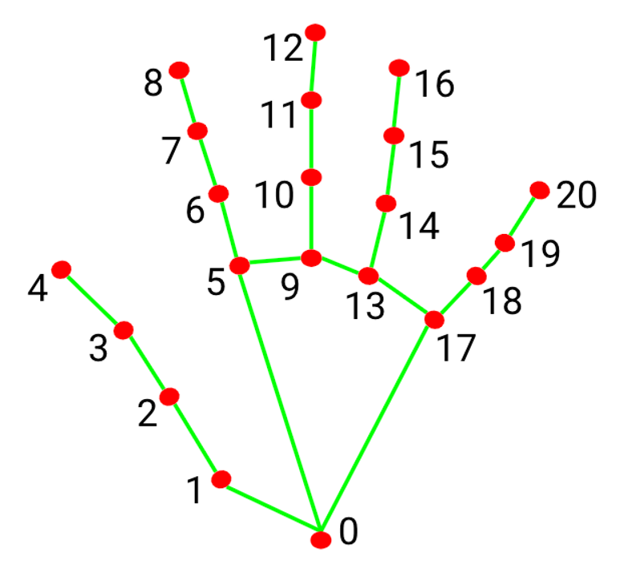

# Hand Gesture Classification Using MediaPipe Landmarks from the HaGRID Dataset  

## 📌 Overview  
This project focuses on classifying hand gestures using **landmark data extracted with MediaPipe** from the HaGRID dataset.  

The input is a **CSV file** containing hand landmarks (**x, y, z** coordinates of 21 key points).  
The output is a **trained machine learning model** that classifies hand gestures into different categories.  

---

## 🖐️ Hand Landmarks  
The landmarks used in this project are based on **MediaPipe's hand tracking model**, which detects **21 key points** on a hand.  

  

Each keypoint has **(x, y, z) coordinates**, which are used to classify gestures.  

---

## 📂 Dataset Details  
- The **HaGRID dataset** contains **18 different hand gestures**.  
- Each gesture is represented by **21 hand landmarks** extracted using MediaPipe.  
- The dataset is stored in a **CSV file**, where each row contains **landmark coordinates** and a **gesture label**.  

---

## 🚀 How to Run the Project  

### 1️⃣ Clone the Repository  
```bash
git clone [https://github.com/SamaQaraa/MLOPS-FINAL-PROJECT-BACKEND.git](https://github.com/SamaQaraa/MLOPS-FINAL-PROJECT-BACKEND.git)
cd MLOPS-FINAL-PROJECT-BACKEND
````

### 2️⃣ Install Dependencies

```bash
pip install -r requirements.txt
```

### 3️⃣ Run MLflow Tracking Server (Local)

Open your terminal and start the MLflow UI:

```bash
mlflow ui
```

Keep this terminal window open. You can access the MLflow UI in your web browser at `http://localhost:5000`.

### 4️⃣ Train and Log Models with Hyperparameter Tuning

In a **new terminal**, navigate to the project directory and run the main script (assuming the training code is saved as `train_models.py`):

```bash
python train_models.py
```

This script will preprocess the data, train multiple machine learning models (Logistic Regression, Decision Tree, Support Vector Machine, and Random Forest) with **GridSearchCV** for hyperparameter tuning, evaluate them, and log all results to your local MLflow tracking server. You will see confusion matrix plots appear for each model as it completes its training and evaluation.

### 5️⃣ Real-Time Gesture Detection

To test the model in real-time using your webcam, run:

```bash
python main.py
```

## 📊 Project Deliverables

### ✅ Automated ML Workflow with MLflow

  - **Data Loading** – Importing the dataset.
  - **Data Preprocessing** – Cleaning and normalizing data by recentering landmarks (wrist as origin) and dividing by mid-finger tip position.
  - **Model Training** – Automated training and evaluation of multiple classifiers, including Logistic Regression, Decision Tree, Support Vector Machine, and Random Forest.
  - **Hyperparameter Tuning** – Utilizes `GridSearchCV` to find optimal hyperparameters for each model.
  - **Experiment Tracking** – Logs models, hyperparameters, and evaluation metrics (accuracy, precision, recall, and F1-score) to MLflow.
  - **Evaluation** – Generates and logs confusion matrices for each trained model.

-----

## ✨ MLflow Tracking & Results

We used MLflow to track and compare the performance of different classification models. The MLflow UI provides a comprehensive overview of each experiment run, including logged parameters, metrics, and model artifacts.

Below is a screenshot of the MLflow UI showing the results for the trained models:

  

Based on the F1-score, the **Support Vector Machine (SVM)** model achieved the best performance:

  * **Support Vector Machine**: F1-score: `0.99066`, Accuracy: `0.98995`
  * **Random Forest**: F1-score: `0.97680`, Accuracy: `0.97602`
  * **Decision Tree**: F1-score: `0.95967`, Accuracy: `0.95404`
  * **Logistic Regression**: F1-score: `0.85369`, Accuracy: `0.84946`

-----

## 🔥 Notes & Improvements

  - Hand landmarks are **recentered** (wrist as origin) to handle scale differences.
  - The **z** coordinate does not require additional processing.
  - The **output is stabilized** by taking the **mode of predictions** over a window.


```